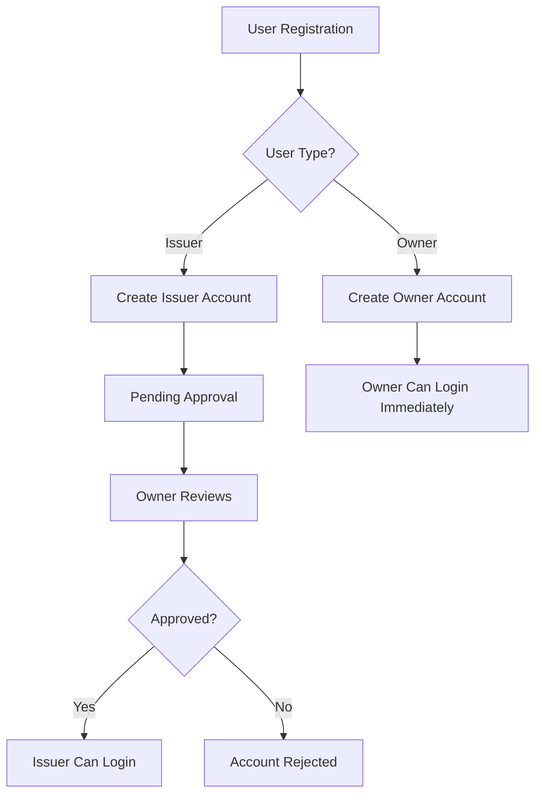

# 🏢 Owner System Implementation Guide

This guide provides step-by-step instructions to implement the owner system and fix the current issues.

## 🔧 **Issues Fixed**

### 1. **Crypto Key Generation Error**
- **Problem**: `TypeError: gt.randomBytes is not a function`
- **Root Cause**: Using Node.js `crypto.randomBytes` in browser environment
- **Solution**: Replaced with Web Crypto API `crypto.getRandomValues()`

### 2. **Owner-Issuer Approval System**
- **Problem**: No owner approval mechanism for new issuers
- **Solution**: Implemented complete owner management system

---

## 📋 **Implementation Steps**

### **Step 1: Update Database Schema**

Run the following SQL script in your Supabase SQL editor:

```sql
-- Update issuers table to include approval system
ALTER TABLE issuers 
ADD COLUMN IF NOT EXISTS is_approved BOOLEAN DEFAULT FALSE,
ADD COLUMN IF NOT EXISTS approved_by UUID REFERENCES owners(id),
ADD COLUMN IF NOT EXISTS approval_date TIMESTAMP WITH TIME ZONE,
ADD COLUMN IF NOT EXISTS approval_notes TEXT;

-- Create owner verification history table
CREATE TABLE IF NOT EXISTS owner_verifications (
    id UUID DEFAULT gen_random_uuid() PRIMARY KEY,
    owner_id UUID REFERENCES owners(id),
    document_hash VARCHAR(255) NOT NULL,
    merkle_root VARCHAR(255) NOT NULL,
    verification_result BOOLEAN NOT NULL,
    verification_date TIMESTAMPTZ DEFAULT NOW(),
    issuer_id VARCHAR(255),
    document_name VARCHAR(255),
    verification_method VARCHAR(50) DEFAULT 'manual' CHECK (verification_method IN ('qr_code', 'manual', 'file_upload'))
);

-- Create issuer approval history table for audit trail
CREATE TABLE IF NOT EXISTS issuer_approval_history (
    id UUID DEFAULT gen_random_uuid() PRIMARY KEY,
    issuer_id VARCHAR(255) NOT NULL,
    owner_id UUID REFERENCES owners(id),
    action VARCHAR(20) NOT NULL CHECK (action IN ('approve', 'reject')),
    approval_notes TEXT,
    created_at TIMESTAMPTZ DEFAULT NOW()
);

-- Add indexes for better performance
CREATE INDEX IF NOT EXISTS idx_issuers_approval_status ON issuers(is_approved);
CREATE INDEX IF NOT EXISTS idx_issuers_approved_by ON issuers(approved_by);
CREATE INDEX IF NOT EXISTS idx_owner_verifications_owner_id ON owner_verifications(owner_id);
CREATE INDEX IF NOT EXISTS idx_owner_verifications_document_hash ON owner_verifications(document_hash);
CREATE INDEX IF NOT EXISTS idx_issuer_approval_history_issuer_id ON issuer_approval_history(issuer_id);
CREATE INDEX IF NOT EXISTS idx_issuer_approval_history_owner_id ON issuer_approval_history(owner_id);

-- Update existing issuers to be pending approval
UPDATE issuers SET is_approved = FALSE WHERE is_approved IS NULL;
```

### **Step 2: Create Owner Account**

1. **Install dependencies** (if not already installed):
```bash
npm install @supabase/supabase-js dotenv
```

2. **Create `.env` file** with your Supabase credentials:
```env
VITE_SUPABASE_URL=your_supabase_project_url
VITE_SUPABASE_ANON_KEY=your_supabase_anon_key
VITE_SUPABASE_SERVICE_ROLE_KEY=your_supabase_service_role_key
```

3. **Run the owner creation script**:
```bash
node create-owner.js
```

4. **Update the owner details** in `create-owner.js`:
```javascript
const ownerData = {
  email: 'admin@yourcompany.com', // Change this
  password: 'YourSecurePassword123!', // Change this
  name: 'Your Company Administrator',
  address: '0xYourMetaMaskAddress', // Change this
}
```

### **Step 3: Test the System**

1. **Start the development server**:
```bash
npm run dev
```

2. **Test owner login**:
   - Go to `http://localhost:8080/owner/login`
   - Use the credentials you set in `create-owner.js`

3. **Test issuer registration**:
   - Go to `http://localhost:8080`
   - Register a new issuer account
   - Check that it shows "pending approval" message

4. **Test owner approval**:
   - Login as owner
   - Go to "Pending Approvals" tab
   - Approve or reject the new issuer

---

## 🏗️ **System Architecture**

### **Database Tables**

#### **Owners Table**
```sql
CREATE TABLE owners (
    id UUID PRIMARY KEY,
    email VARCHAR(255) UNIQUE NOT NULL,
    password VARCHAR(255) NOT NULL,
    address VARCHAR(255) NOT NULL,
    name VARCHAR(255) NOT NULL,
    created_at TIMESTAMP WITH TIME ZONE DEFAULT NOW(),
    updated_at TIMESTAMP WITH TIME ZONE DEFAULT NOW()
);
```

#### **Issuers Table (Updated)**
```sql
CREATE TABLE issuers (
    id UUID PRIMARY KEY,
    email VARCHAR(255) UNIQUE NOT NULL,
    password VARCHAR(255) NOT NULL,
    address VARCHAR(255) NOT NULL,
    issuer_id VARCHAR(255) UNIQUE NOT NULL,
    name VARCHAR(255) NOT NULL,
    public_key TEXT NOT NULL,
    private_key TEXT NOT NULL,
    meta_mask_address VARCHAR(255) NOT NULL,
    is_approved BOOLEAN DEFAULT FALSE, -- NEW
    approved_by UUID REFERENCES owners(id), -- NEW
    approval_date TIMESTAMP WITH TIME ZONE, -- NEW
    approval_notes TEXT, -- NEW
    created_at TIMESTAMP WITH TIME ZONE DEFAULT NOW(),
    updated_at TIMESTAMP WITH TIME ZONE DEFAULT NOW()
);
```

### **Authentication Flow**



### **Owner Dashboard Features**

1. **Pending Approvals**
   - View new issuer registrations
   - Approve or reject issuers
   - Add approval notes

2. **Approved Issuers**
   - View all approved issuers
   - See approval history
   - Manage issuer status

3. **System Statistics**
   - Total issuers count
   - Pending approvals count
   - Verification statistics

---

## 🔐 **Security Features**

### **Access Control**
- Only one owner account allowed per system
- Owner must approve all new issuers
- Role-based access control (owner vs issuer)

### **Approval Process**
- New issuers are automatically set to `is_approved = false`
- Owner must explicitly approve each issuer
- Approval history is logged for audit trail

### **Key Management**
- Fixed crypto key generation for browser compatibility
- Proper error handling for key generation failures
- Fallback to simple keys if crypto generation fails

---

## 🚀 **Usage Instructions**

### **For System Administrators**

1. **Create Owner Account**:
   ```bash
   node create-owner.js
   ```

2. **Login to Owner Dashboard**:
   - Visit `/owner/login`
   - Use owner credentials

3. **Manage Issuers**:
   - View pending approvals
   - Approve/reject new issuers
   - Monitor system activity

### **For New Issuers**

1. **Register Account**:
   - Visit the main registration page
   - Fill in issuer details
   - Connect MetaMask wallet

2. **Wait for Approval**:
   - Account is created but not activated
   - Owner will review and approve
   - Email notification when approved

3. **Access System**:
   - Login after approval
   - Start issuing documents

---

## 🛠️ **Troubleshooting**

### **Common Issues**

#### **1. "gt.randomBytes is not a function" Error**
- **Cause**: Using Node.js crypto in browser
- **Solution**: Already fixed with Web Crypto API

#### **2. "Owner account already exists" Error**
- **Cause**: Trying to create multiple owners
- **Solution**: Only one owner allowed per system

#### **3. "Access denied" on Owner Login**
- **Cause**: User metadata doesn't specify owner type
- **Solution**: Check user metadata in Supabase Auth

#### **4. Issuer Registration Fails**
- **Cause**: Missing required fields or validation errors
- **Solution**: Check form validation and required fields

### **Debug Steps**

1. **Check Browser Console**:
   - Look for JavaScript errors
   - Check network requests

2. **Check Supabase Logs**:
   - Review authentication logs
   - Check database queries

3. **Verify Environment Variables**:
   - Ensure Supabase credentials are correct
   - Check API key permissions

---

## 📞 **Support**

If you encounter issues:

1. Check the browser console for errors
2. Review Supabase logs
3. Verify database schema is updated
4. Ensure environment variables are set

The system is now ready for production use with proper owner-issuer approval workflow!
