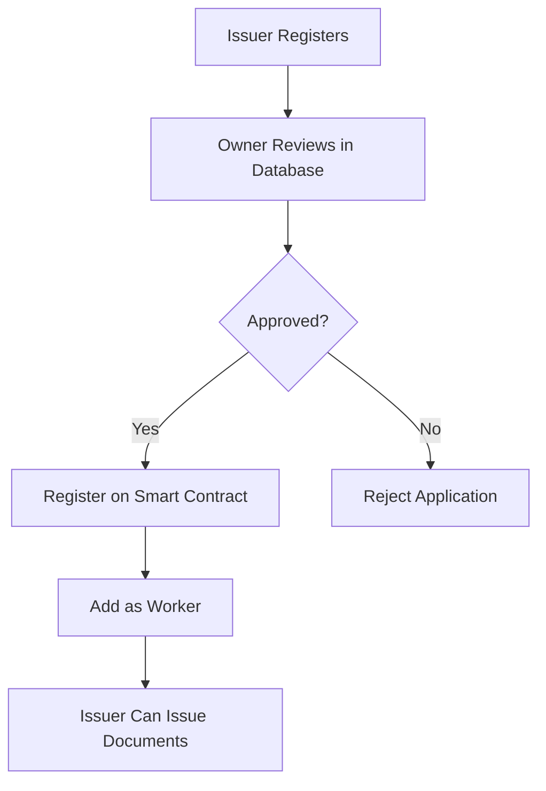

# 🔍 Smart Contract Analysis: Owner-Issuer Relationship

## 📋 **Contract Details**

**Contract Address**: `0x1253369dab29F77692bF84DB759583ac47F66532`  
**Network**: Polygon Amoy Testnet  
**Chain ID**: 80002  
**Explorer**: https://amoy.polygonscan.com/address/0x1253369dab29F77692bF84DB759583ac47F66532

---

## 🏗️ **Smart Contract Architecture**

### **Role Hierarchy**
```
Contract Owner (Deployer)
    ↓
Workers (Added by Owner)
    ↓
Issuers (Registered by Owner)
```

### **Access Control Model**

#### **1. Contract Owner (Only One)**
- **Who**: The address that deployed the contract
- **Powers**:
  - Add/remove workers
  - Register/remove issuers
  - Invalidate documents
  - Manage contract settings
- **Functions**: `addWorker()`, `registerIssuer()`, `invalidateDocument()`, etc.

#### **2. Workers (Multiple)**
- **Who**: Addresses added by the contract owner
- **Powers**:
  - Store Merkle roots on-chain
  - Upload document batches
- **Functions**: `putRoot()`, `getRootTimestamp()`

#### **3. Issuers (Multiple)**
- **Who**: Document issuers registered by the contract owner
- **Powers**:
  - Issue documents (off-chain)
  - Sign documents with their private keys
- **Functions**: None on-chain (they work through workers)

---

## 🔐 **Key Smart Contract Functions**

### **Owner-Only Functions**
```solidity
// Worker Management
function addWorker(address addr) public onlyOwner
function isWorker(address addr) public view returns (bool)

// Issuer Registration
function registerIssuer(string memory issuerId, address pubKey, string memory name) public onlyOwner

// Document Invalidation
function invalidateDocument(bytes32 docHash, bytes memory signature, string memory issuerId) public onlyOwner
function invalidateRoot(bytes32 rootHash, bytes memory signature, string memory issuerId) public onlyOwner
```

### **Worker-Only Functions**
```solidity
// Merkle Root Storage
function putRoot(bytes32 merkleRoot) public onlyWorker
```

### **Public Functions**
```solidity
// Verification
function getIssuerDetails(string memory issuerId) public view returns (string memory, string memory, IssuerPubKey[] memory)
function isInvalidated(bytes32 docHash, bytes32 rootHash, string memory issuerId, uint256 invExpiry, uint256 issuedAt) public view returns (string memory, uint256)
```

---

## 🔗 **Owner-Issuer Relationship Flow**

### **Step 1: Contract Deployment**
1. Contract deployed by owner address
2. Owner becomes the contract administrator
3. Only owner can add workers and register issuers

### **Step 2: Worker Addition**
```solidity
// Owner calls this function
function addWorker(address workerAddress) public onlyOwner {
    workers.push(workerAddress);
    emit WorkerAdded(workerAddress);
}
```

### **Step 3: Issuer Registration**
```solidity
// Owner calls this function
function registerIssuer(string memory issuerId, address pubKey, string memory name) public onlyOwner {
    issuers[issuerId] = IssuerInfo({
        name: name,
        pubKey: pubKey,
        isActive: true
    });
    emit IssuerRegistered(issuerId, name, pubKey);
}
```

### **Step 4: Document Issuance Flow**
1. **Issuer** creates documents off-chain
2. **Issuer** signs documents with private key
3. **Worker** stores Merkle roots on-chain via `putRoot()`
4. **Public** can verify documents using contract functions

---

## 🎯 **Current Implementation Issues**

### **Problem 1: Database vs Smart Contract Mismatch**
- **Smart Contract**: Owner can register issuers directly
- **Database**: Owner must approve issuers before they can work
- **Result**: Two separate approval systems that don't sync

### **Problem 2: Missing Link Between Systems**
- **Smart Contract**: Uses wallet addresses for identification
- **Database**: Uses email addresses for identification
- **Result**: No way to link on-chain and off-chain identities

### **Problem 3: Worker vs Issuer Confusion**
- **Smart Contract**: Workers can store Merkle roots
- **Database**: Issuers create documents
- **Result**: Unclear who actually does what in the system

---

## 🔧 **Recommended Solutions**

### **Solution 1: Sync Smart Contract with Database**
```typescript
// When owner approves issuer in database
async function approveIssuer(issuerId: string, metaMaskAddress: string) {
  // 1. Update database
  await supabase.from('issuers').update({
    is_approved: true,
    approved_by: ownerId
  }).eq('issuer_id', issuerId)
  
  // 2. Register on smart contract
  const contract = getContractInstance(true) // Use owner wallet
  await contract.registerIssuer(issuerId, metaMaskAddress, issuerName)
  
  // 3. Add as worker if needed
  await contract.addWorker(metaMaskAddress)
}
```

### **Solution 2: Link Wallet Addresses**
```sql
-- Add blockchain_address to issuers table
ALTER TABLE issuers 
ADD COLUMN blockchain_address VARCHAR(255) UNIQUE;

-- Link issuer's MetaMask address to smart contract
UPDATE issuers 
SET blockchain_address = meta_mask_address 
WHERE is_approved = true;
```

### **Solution 3: Unified Approval Flow**


---

## 📊 **Smart Contract State Verification**

### **Check Contract Owner**
```javascript
// Get contract owner
const contract = getContractInstance()
const owner = await contract.owner()
console.log('Contract Owner:', owner)
```

### **Check Registered Workers**
```javascript
// Get all workers
const workers = await contract.getWorkers()
console.log('Workers:', workers)
```

### **Check Registered Issuers**
```javascript
// Get issuer details
const issuerDetails = await contract.getIssuerDetails('issuer_123')
console.log('Issuer Details:', issuerDetails)
```

### **Check Merkle Roots**
```javascript
// Check if Merkle root exists
const timestamp = await contract.getRootTimestamp(merkleRoot)
console.log('Root Timestamp:', timestamp)
```

---

## 🚨 **Critical Issues to Address**

### **1. Owner Wallet Management**
- **Issue**: Contract owner is a single wallet address
- **Risk**: If private key is lost, contract becomes unmanageable
- **Solution**: Use multi-sig or DAO governance

### **2. Worker vs Issuer Roles**
- **Issue**: Unclear distinction between workers and issuers
- **Risk**: Security vulnerabilities if roles are mixed
- **Solution**: Define clear role responsibilities

### **3. Database-Smart Contract Sync**
- **Issue**: Two separate systems managing the same data
- **Risk**: Data inconsistency and security gaps
- **Solution**: Implement proper synchronization

---

## 🎯 **Next Steps**

1. **Verify Contract State**: Check current owner, workers, and issuers
2. **Link Database to Smart Contract**: Sync approval systems
3. **Implement Unified Flow**: Single approval process
4. **Test Integration**: Ensure both systems work together
5. **Document Process**: Clear instructions for owner operations

The smart contract provides a solid foundation, but it needs proper integration with the database system to work effectively.
