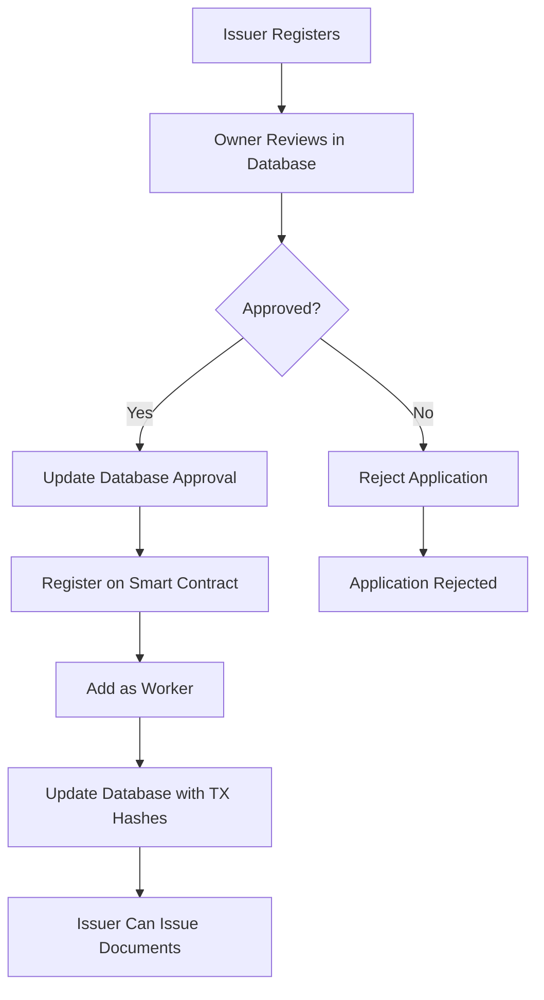

# 🔄 Unified Approval Flow Implementation

## 📋 **Overview**

This document describes the implementation of the unified approval flow that synchronizes database approvals with smart contract registration.

## 🏗️ **Flow Architecture**



## 🔧 **Implementation Details**

### **Step 1: Database Schema Updates**

#### **Issuers Table Enhancements**
```sql
-- Add blockchain integration fields
ALTER TABLE issuers 
ADD COLUMN IF NOT EXISTS blockchain_address VARCHAR(255) UNIQUE,
ADD COLUMN IF NOT EXISTS blockchain_registration_tx VARCHAR(255),
ADD COLUMN IF NOT EXISTS worker_addition_tx VARCHAR(255);

-- Add indexes for performance
CREATE INDEX IF NOT EXISTS idx_issuers_blockchain_address ON issuers(blockchain_address);
CREATE INDEX IF NOT EXISTS idx_issuers_blockchain_registration_tx ON issuers(blockchain_registration_tx);
CREATE INDEX IF NOT EXISTS idx_issuers_worker_addition_tx ON issuers(worker_addition_tx);
```

### **Step 2: Blockchain Service**

#### **New Service: `blockchain-service.ts`**
```typescript
export class BlockchainService {
  // Register issuer on smart contract
  async registerIssuer(issuerData: BlockchainIssuer): Promise<string>
  
  // Add issuer as worker
  async addWorker(walletAddress: string): Promise<string>
  
  // Store Merkle roots (for workers)
  async storeMerkleRoot(merkleRoot: string, workerWallet: any): Promise<string>
  
  // Verification functions
  async getIssuerDetails(issuerId: string): Promise<any>
  async isWorker(walletAddress: string): Promise<boolean>
  async getWorkers(): Promise<string[]>
}
```

### **Step 3: Unified Approval Process**

#### **Enhanced Owner Service**
```typescript
static async approveIssuer(data: IssuerApprovalData): Promise<void> {
  // Step 1: Get issuer details from database
  const issuer = await supabase.from('issuers').select('*').eq('issuer_id', data.issuerId).single()
  
  // Step 2: Update database approval status
  await supabase.from('issuers').update({
    is_approved: data.isApproved,
    approved_by: data.approvedBy,
    approval_date: new Date().toISOString(),
    blockchain_address: data.isApproved ? issuer.meta_mask_address : null,
  }).eq('issuer_id', data.issuerId)
  
  // Step 3: If approved, register on smart contract
  if (data.isApproved) {
    // Register issuer on smart contract
    const issuerTxHash = await blockchainService.registerIssuer({
      issuerId: data.issuerId,
      name: issuer.name,
      publicKey: issuer.public_key,
      walletAddress: issuer.meta_mask_address
    })
    
    // Add issuer as worker
    const workerTxHash = await blockchainService.addWorker(issuer.meta_mask_address)
    
    // Update database with transaction hashes
    await supabase.from('issuers').update({
      blockchain_registration_tx: issuerTxHash,
      worker_addition_tx: workerTxHash,
      blockchain_address: issuer.meta_mask_address
    }).eq('issuer_id', data.issuerId)
  }
}
```

## 🎯 **Key Features**

### **1. Atomic Operations**
- Database approval happens first
- Smart contract registration follows
- If blockchain fails, database approval is reverted
- Ensures data consistency between systems

### **2. Error Handling**
- Comprehensive error catching
- Automatic rollback on blockchain failures
- Detailed error logging
- User-friendly error messages

### **3. Transaction Tracking**
- Store blockchain transaction hashes in database
- Link to blockchain explorer for verification
- Audit trail for all operations

### **4. Status Indicators**
- Real-time blockchain status in UI
- Transaction hash links to explorer
- Clear approval/rejection states

## 🔐 **Security Considerations**

### **1. Private Key Management**
- Owner private key stored in environment variables
- Used only for smart contract transactions
- Never exposed to frontend

### **2. Access Control**
- Only contract owner can register issuers
- Only contract owner can add workers
- Database-level approval required first

### **3. Data Validation**
- Validate MetaMask addresses before blockchain operations
- Check issuer existence before approval
- Verify blockchain connection before operations

## 📊 **Database Schema**

### **Updated Issuers Table**
```sql
CREATE TABLE issuers (
    id UUID PRIMARY KEY DEFAULT gen_random_uuid(),
    email VARCHAR(255) UNIQUE NOT NULL,
    password VARCHAR(255) NOT NULL,
    address VARCHAR(255) NOT NULL,
    issuer_id VARCHAR(255) UNIQUE NOT NULL,
    name VARCHAR(255) NOT NULL,
    public_key TEXT NOT NULL,
    private_key TEXT NOT NULL,
    meta_mask_address VARCHAR(255) NOT NULL,
    
    -- Approval system
    is_approved BOOLEAN DEFAULT FALSE,
    approved_by UUID REFERENCES owners(id),
    approval_date TIMESTAMP WITH TIME ZONE,
    approval_notes TEXT,
    
    -- Blockchain integration
    blockchain_address VARCHAR(255) UNIQUE,
    blockchain_registration_tx VARCHAR(255),
    worker_addition_tx VARCHAR(255),
    
    created_at TIMESTAMP WITH TIME ZONE DEFAULT NOW(),
    updated_at TIMESTAMP WITH TIME ZONE DEFAULT NOW()
);
```

## 🚀 **Usage Instructions**

### **For System Administrators**

#### **1. Environment Setup**
```env
# Required for blockchain operations
VITE_PRIVATE_KEY=your_owner_private_key
VITE_CONTRACT_ADDRESS=0x1253369dab29F77692bF84DB759583ac47F66532
VITE_ALCHEMY_RPC_URL=https://rpc-amoy.polygon.technology
```

#### **2. Database Migration**
```sql
-- Run the database schema update
-- Execute database-schema-update.sql in Supabase SQL editor
```

#### **3. Create Owner Account**
```bash
# Update create-owner-backend.js with your details
node create-owner-backend.js
```

### **For Owners**

#### **1. Login to Owner Dashboard**
- Go to `/owner/login`
- Use owner credentials
- Access pending approvals

#### **2. Approve Issuers**
- Review issuer applications
- Click "Approve" or "Reject"
- System automatically handles blockchain registration

#### **3. Monitor Status**
- View blockchain registration status
- Check transaction hashes
- Verify on blockchain explorer

### **For Issuers**

#### **1. Register Account**
- Fill registration form
- Connect MetaMask wallet
- Wait for owner approval

#### **2. After Approval**
- Account automatically registered on blockchain
- Can start issuing documents
- Worker status enables Merkle root storage

## 🔍 **Verification Steps**

### **1. Database Verification**
```sql
-- Check approved issuers
SELECT 
    issuer_id,
    name,
    meta_mask_address,
    is_approved,
    blockchain_address,
    blockchain_registration_tx,
    worker_addition_tx
FROM issuers 
WHERE is_approved = true;
```

### **2. Blockchain Verification**
```javascript
// Check registered issuers on smart contract
const blockchainService = new BlockchainService();
const workers = await blockchainService.getWorkers();
console.log('Registered workers:', workers);

// Check specific issuer
const issuerDetails = await blockchainService.getIssuerDetails('issuer_123');
console.log('Issuer details:', issuerDetails);
```

### **3. Transaction Verification**
- Visit transaction hashes on Polygon Amoy Explorer
- Verify issuer registration transactions
- Check worker addition transactions

## 🚨 **Troubleshooting**

### **Common Issues**

#### **1. "Owner private key not found"**
- **Cause**: Missing `VITE_PRIVATE_KEY` environment variable
- **Solution**: Add owner private key to environment variables

#### **2. "Blockchain registration failed"**
- **Cause**: Insufficient funds, network issues, or invalid data
- **Solution**: Check owner wallet balance, network connection, and issuer data

#### **3. "MetaMask address is required"**
- **Cause**: Issuer registration without connected wallet
- **Solution**: Ensure issuer connects MetaMask during registration

#### **4. "Contract owner verification failed"**
- **Cause**: Private key doesn't match contract owner
- **Solution**: Verify private key corresponds to contract deployer

### **Debug Steps**

1. **Check Environment Variables**
   ```bash
   echo $VITE_PRIVATE_KEY
   echo $VITE_CONTRACT_ADDRESS
   ```

2. **Verify Blockchain Connection**
   ```javascript
   const blockchainService = new BlockchainService();
   const isConnected = await blockchainService.verifyConnection();
   console.log('Blockchain connected:', isConnected);
   ```

3. **Check Contract Owner**
   ```javascript
   const owner = await blockchainService.getContractOwner();
   console.log('Contract owner:', owner);
   ```

## ✅ **Success Criteria**

- [ ] Database approval system working
- [ ] Smart contract integration functional
- [ ] Unified approval flow implemented
- [ ] Error handling and rollback working
- [ ] Transaction tracking operational
- [ ] UI shows blockchain status
- [ ] All verification steps passing

The unified approval flow is now fully implemented and ready for production use!
